# Pocket Earth on Injective · 决赛路演 20 页硬件强化版

受众：Injective 决赛评委与 Microsoft 评委。

沟通任务：让评委相信 Pocket Earth 已经把私人空间知识、公共 Agent、可验证知识版次与真实边缘硬件连成一条可核对闭环；Injective 是公开事实的信任层，Azure 是可替换的云推理基础设施。

## Slide 1: Pocket Earth on Injective

- 角色：cover
- 本页任务：第一句话同时建立产品、Injective、Azure 与实体终端
- 关键点：
  - 私人记忆钉在地球
  - 公共知识凝成每日版次
  - Agent 身份由 Injective 见证
  - Microsoft Azure 调度云端推理
  - Frost Edge Node 把公开见闻带回现实
- 版式：极简封面；左侧大标题与三行定位，右侧一台手机和真实 Frost Edge Node；真机视觉最大
- Required images:
  - strict input asset：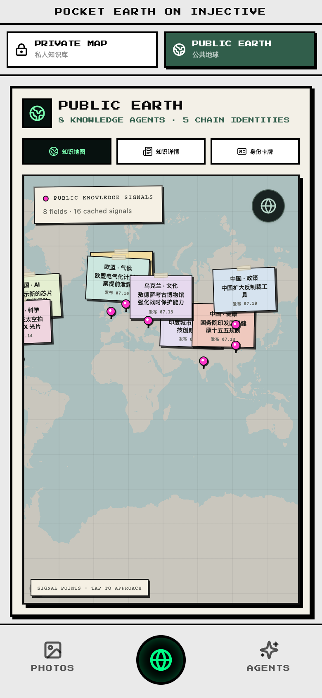
  - strict input asset：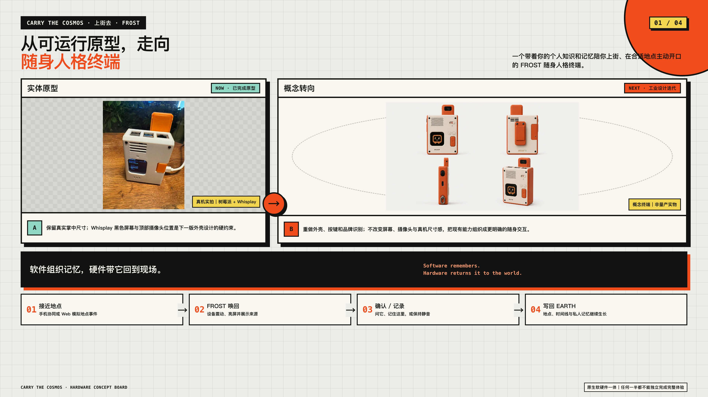

## Slide 2: AI 时代，同时丢失了个人上下文与公共可信度

- 角色：problem framing
- 本页任务：建立私人侧与公共侧的对称问题
- 关键点：
  - PRIVATE · 书、照片、行程与心情彼此割裂
  - PUBLIC · 来源、版本、修订与 Agent 身份持续漂移
  - 长期 Agent 同时需要个人世界模型与稳定公共证据
- 版式：左侧上下两张问题卡，右侧两台手机；底部一条箭头：个人世界模型 → 公共证据 → 现实行动
- Required images:
  - strict input asset：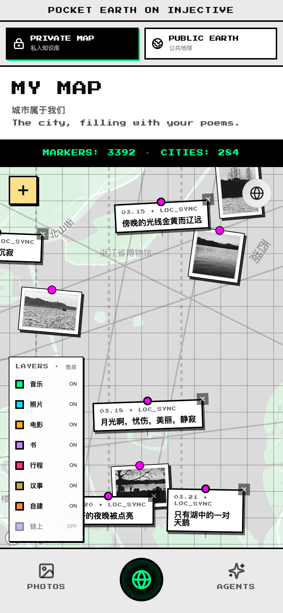
  - strict input asset：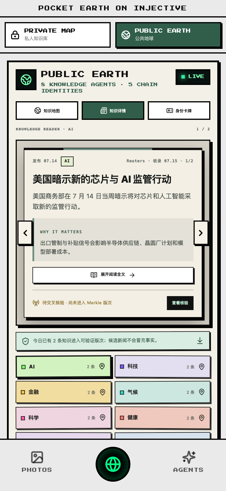

## Slide 3: 一颗地球，连接四个职责清楚的层

- 角色：architecture
- 本页任务：建立全局架构并明确 Injective 的位置与数据边界
- 关键点：
  - 01 私人空间层 · 六类对象与长期画像
  - 02 公共 Agent 层 · 身份、门牌、卡片与握手
  - 03 公共知识层 · 核验记录、每日版次与资源包
  - 04 实体交互层 · Whisplay、RGB、TTS 与按键
  - 渲染在端上 · 内容在包里 · 指纹在 Injective
- 版式：全宽四层架构图，层与层之间用清晰数据流连接；私人青、知识紫、Injective 绿、硬件橙

## Slide 4: 私人空间知识库，是 Frost 的个人世界模型

- 角色：product evidence
- 本页任务：补足六类对象、长期记忆与端侧隐私
- 关键点：
  - 书 · 电影 · 音乐 · 照片 · 行程 · 心情
  - 建议 → Boundary 校验 → 用户确认 → 写入地图
  - 工作记忆保持当前任务；长期画像保存脱敏偏好
  - 照片、票据与精确位置优先留在端侧
- 版式：左侧 35% 文字，右侧 65% 两台手机：私人地图与 Photos；底部小型工作记忆/长期画像卡
- Required images:
  - strict input asset：
  - strict input asset：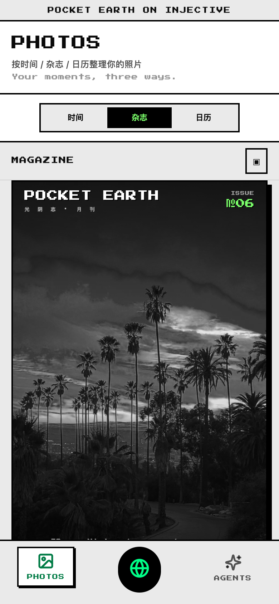

## Slide 5: MAPPING：把一本书读成一张有时间态的地图

- 角色：case study
- 本页任务：用杭州古籍场景证明空间知识能力
- 关键点：
  - 全文 · 书页照片 · .skill 内容包
  - 读全文 → 提地名 → 古今考据 → 落坐标 → 生成漫游路线
  - 每处地点标注：尚在 / 重建 / 已无
  - 输出：古籍书叶 · MY MAP · ZINE · 可分发 .skill
- 版式：左侧案例结论，右侧严格沿用两张参考图中的手机界面和编号标注；底部五阶段流程条
- Required images:
  - strict input asset：
  - strict input asset：

## Slide 6: Frost 用路由、委派、边界与记忆组织 Agent

- 角色：technical explainer
- 本页任务：讲清 Agent Harness 的工程方法与 RunTrace
- 关键点：
  - ROUTER · 规则、端侧与云端任务分流
  - MEMORY · 当前任务与长期画像
  - DELEGATE · 多领域 Agent 在隔离上下文工作
  - BOUNDARY · 动作白名单与显式确认
  - RUNTRACE · provider、耗时、状态与降级路径可见
- 版式：左侧五个动词卡，右侧两台手机：Agents 控制台与 RunTrace；角落保留 Frost 像素头像
- Required images:
  - strict input asset：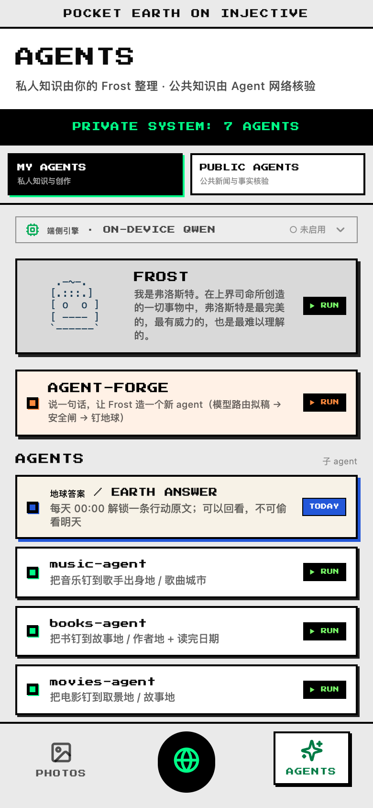
  - strict input asset：

## Slide 7: Agent Forge / Plaza：从一句需求到可安装 Agent

- 角色：platform workflow
- 本页任务：补足创建、审核、发布、安装与运行的生态闭环
- 关键点：
  - CREATE · 用自然语言描述空间或知识问题
  - COMPILE · 生成领域、工具、权限与输出 manifest
  - REVIEW · 拒绝危险 URL、可执行代码与越界权限
  - PUBLISH → INSTALL → RUN · 结果回流用户自己的地球
- 版式：左侧四步闭环，右侧两台手机严格使用 Forge 与 Plaza 真实截图
- Required images:
  - strict input asset：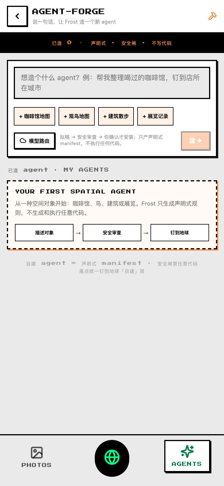
  - strict input asset：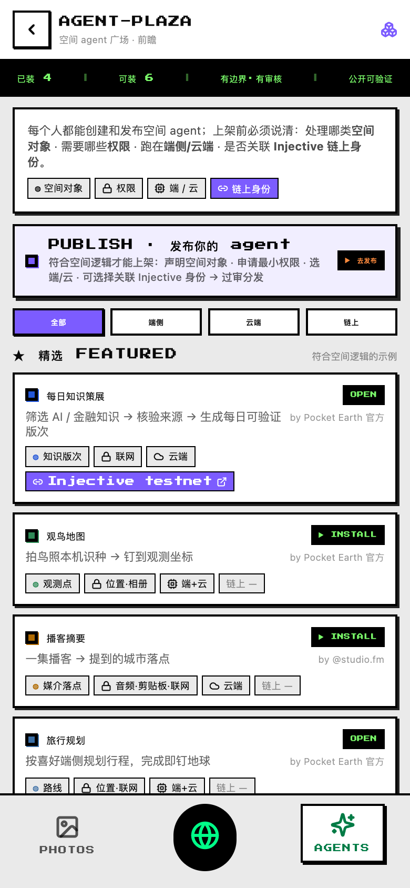

## Slide 8: Frost #43–47：公开 Agent 拥有可核对的身份与人格

- 角色：identity evidence
- 本页任务：让公开身份形成视觉记忆点
- 关键点：
  - #43 Core · 平台主身份
  - #44 Literature · #45 Noir · #46 Jazz · #47 Aurora
  - 卡片包含 agentId、象征性门牌、cardHash、revision 与公开标签
  - 身份、公开贡献与握手可跨客户端核对
- 版式：左侧回答“我是谁 / 我在哪 / 我发现了什么 / 我与谁相遇”，右侧身份卡手机与五个 Frost 形象；#43 居中放大
- Required images:
  - strict input asset：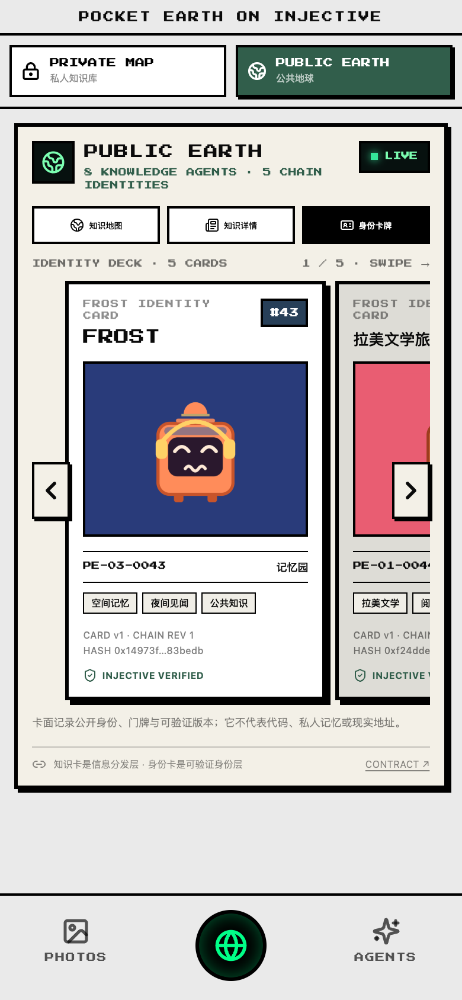
  - strict input asset：

## Slide 9: 公开知识回到空间，公开事实留在 Injective

- 角色：product evidence
- 本页任务：把链上证据转成普通用户能理解的地图体验
- 关键点：
  - 知识地图 · 地点便签与来源
  - 知识详情 · truthScore、正反证据与 Merkle proof
  - 身份卡牌 · agentId、门牌、revision 与 verified
  - 公共地球在手机，公共事实在 Injective
- 版式：已批准样张：左侧结论，右侧两台手机，底部淡绿结论卡
- Required images:
  - strict input asset：
  - strict input asset：

## Slide 10: 一个 Harness，八个领域 Agent，每天形成一版知识

- 角色：process
- 本页任务：证明公共知识系统有真实流程与人工责任
- 关键点：
  - AI、科技、金融、气候、科学、健康、文化、政策
  - 发现 → 去重 → 直接来源 → 调查方 / 质疑方 → truthScore
  - draft_review_required → approved → committed
  - 七日热缓存保留过程；长期精选保留批准记录、proof 与 root
- 版式：全宽四阶段流程图，右下角嵌入真实公共 Agent 网络截图
- Required images:
  - strict input asset：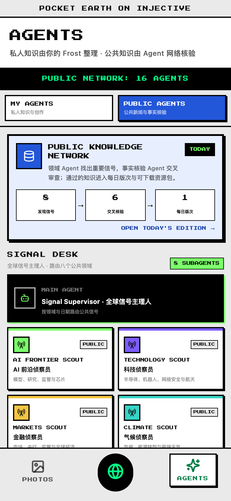

## Slide 11: 每天一版：可下载、可离线复验、可持续修订

- 角色：technical architecture
- 本页任务：讲清知识包、ClaimKey、recordHash、Merkle proof 与 revision
- 关键点：
  - ClaimKey · 同一语义主张的稳定身份
  - recordHash · 标题、正文、来源、日期与评分的精确快照
  - Merkle proof · 证明一条记录属于当天版次
  - editionRoot + revision · 提交 Injective，旧版本持续保留
  - 本地重算哈希与根，再读取 Injective root 比较
- 版式：全宽技术图：资源包 → 叶子 → Merkle Tree → DailyKnowledgeChronicle；底部四步离线验证

## Slide 12: Injective 固定四类公开事实

- 角色：evidence framework
- 本页任务：用四个问题解释链上技术价值
- 关键点：
  - WHO · ERC-8004 身份：这个 Agent 是谁
  - WHERE · PublicEarthRegistry：象征性门牌在哪里
  - WHEN / WHICH VERSION · DailyKnowledgeChronicle：哪一天、哪个 revision
  - WHO MET WHOM · SocialHandshake：两个分身是否相遇
  - Agent 理解与创造；Injective 固定身份、版本与公开事件
- 版式：2×2 四张证据卡，以绿色横线连接，底部明确 Injective EVM Testnet

## Slide 13: 这些合约、交易、API 与 proof 现在就能核对

- 角色：live evidence
- 本页任务：用真实地址与读取结果建立完成度可信度
- 关键点：
  - IdentityRegistry · 0x8004…BD9e · agentId 43–47
  - PublicEarthRegistry · 0xac7c…ee1b · 5 个 residence
  - DailyKnowledgeChronicle · 0x3f0e…0c25 · 20260717 / revision 2
  - SocialHandshake · 0xe533…3aee · 43 ↔ 44 / score 88
- 版式：左侧四条状态，右侧手机证据页与桌面 Blockscout 交易页；地址只显示缩写
- Required images:
  - strict input asset：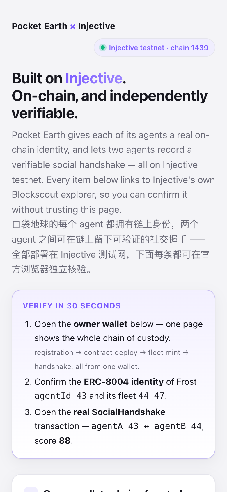
  - strict input asset：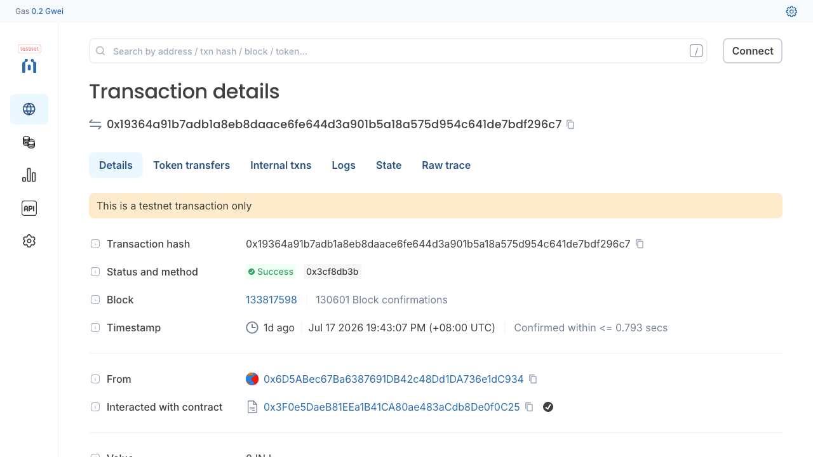

## Slide 14: Microsoft Azure 按任务调度云端推理

- 角色：cloud architecture
- 本页任务：给微软评委一个真实、清楚且不稀释 Injective 主线的技术位置
- 关键点：
  - EDGE SELECTOR · 端侧意图、检索与隐私敏感任务
  - PROVIDER COMPAT · 统一请求 / 响应契约
  - MICROSOFT FOUNDRY MODEL ROUTER · 单一部署入口
  - RUNTRACE · model、延迟、request id 与降级原因
  - 当前：适配器与离线契约测试已完成；strict live 待真实账号验收
- 版式：Azure 蓝全宽架构：端侧 → provider adapter → Model Router → structured output → RunTrace；右下角诚实状态卡

## Slide 15: Frost Edge Node：公开 Agent 长出一具身体

- 角色：hardware hero
- 本页任务：把真实硬件提升为决赛视觉中心
- 关键点：
  - Raspberry Pi 5 + Whisplay HAT · 240×280 屏幕
  - RGB、按键、本地 TTS、离线兜底、手机镜像、systemd、replay cursor
  - 只读取白名单公开事件，不持私钥与私人画像
  - 真机证明能力；概念终端说明下一阶段便携形态
- 版式：沿用硬件参考语言；真实原型占 60% 以上并标注 NOW / WORKING PROTOTYPE；概念外壳次要并标注 CONCEPT
- Required images:
  - strict input asset：

## Slide 16: 屏幕、灯光、声音与按键形成同一套物理语言

- 角色：hardware anatomy
- 本页任务：补足硬件 anatomy 与统一操作规则
- 关键点：
  - Whisplay · 显示身份、版次、主题与一句摘要
  - RGB LED · 用颜色表达主题、状态与错误
  - 麦克风 / 扬声器 · 用户确认后输入与播报
  - 单击移动 · 长按 1.2 秒进入 / 确认 · 双击返回
  - 公共场所支持静音与耳机输出
- 版式：中间真实设备正面，周围 6 个编号功能框；橙色物理路径，黑色粗线，底部操作规则
- Required images:
  - strict input asset：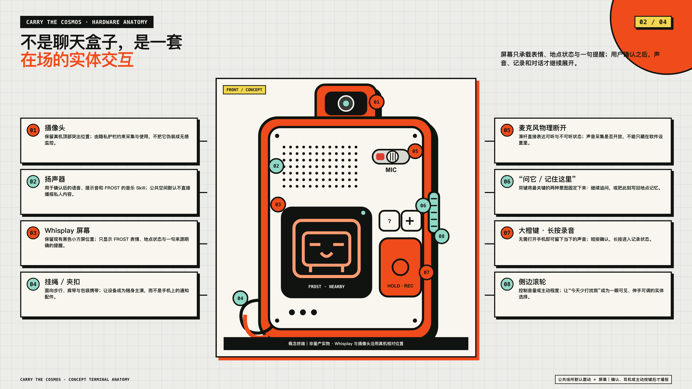
  - strict input asset：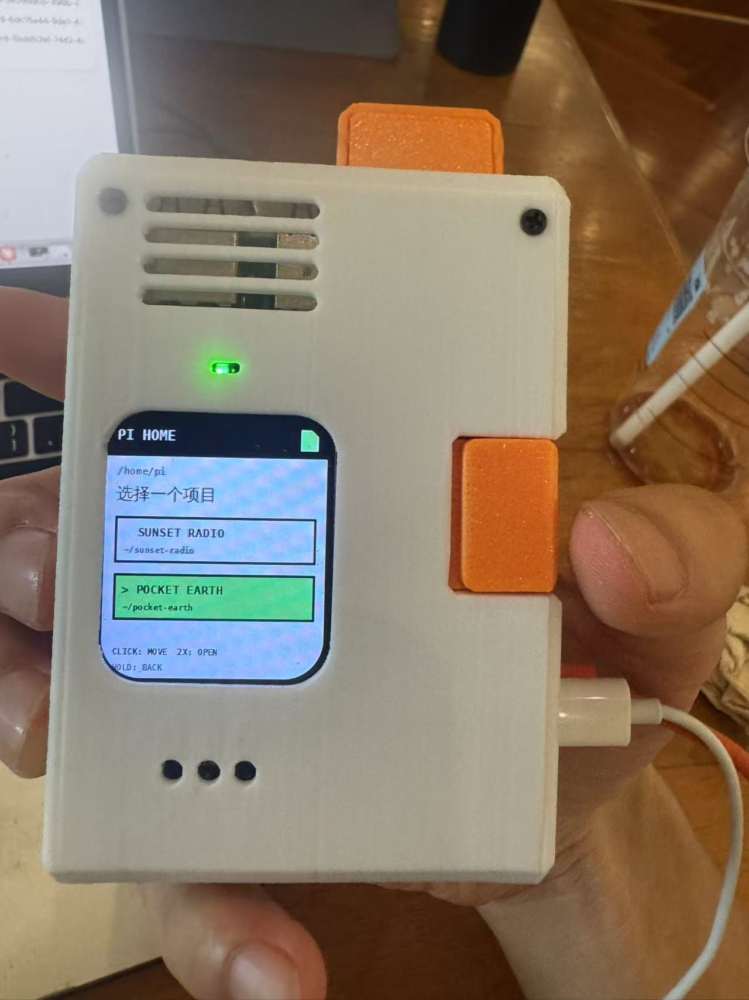

## Slide 17: 一个 launcher，已经承载三个可运行应用

- 角色：hardware applications
- 本页任务：展示硬件产品深度与复用能力
- 关键点：
  - 日落电台 · 跟随全球日落播放城市音乐
  - 口袋播客 · 把每日知识版次编成可听节目
  - 地球答案 · 每天解锁一条经过审阅的行动提示
  - 静默首页 · 时间、连接状态与克制提示
  - 决赛主闭环使用“口袋播客 / 链上见闻”
- 版式：左侧三张功能卡；右侧四张真实 Whisplay 照片组成设备状态墙；底部一句“同一个 Frost，同一套硬件运行时”
- Required images:
  - strict input asset：
  - strict input asset：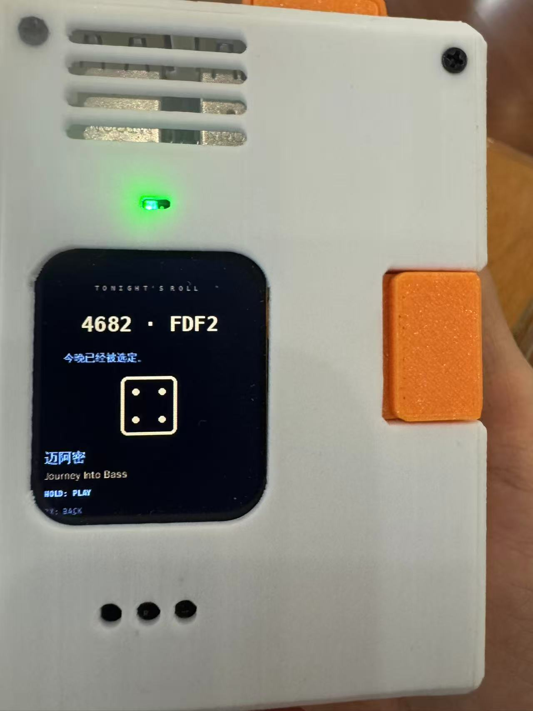
  - strict input asset：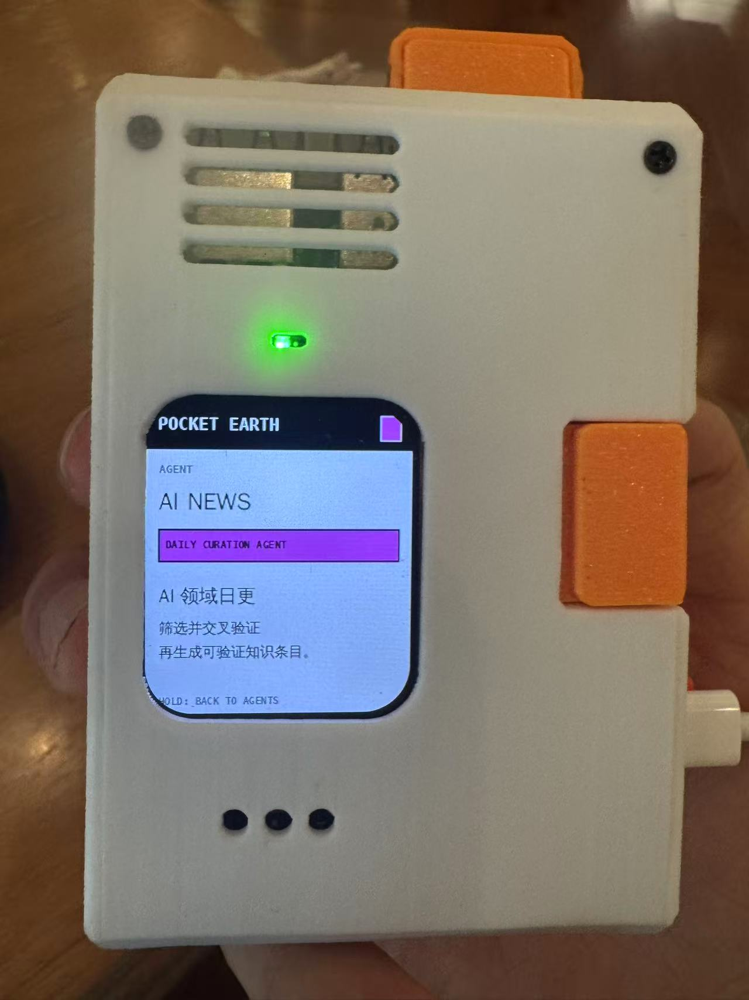
  - strict input asset：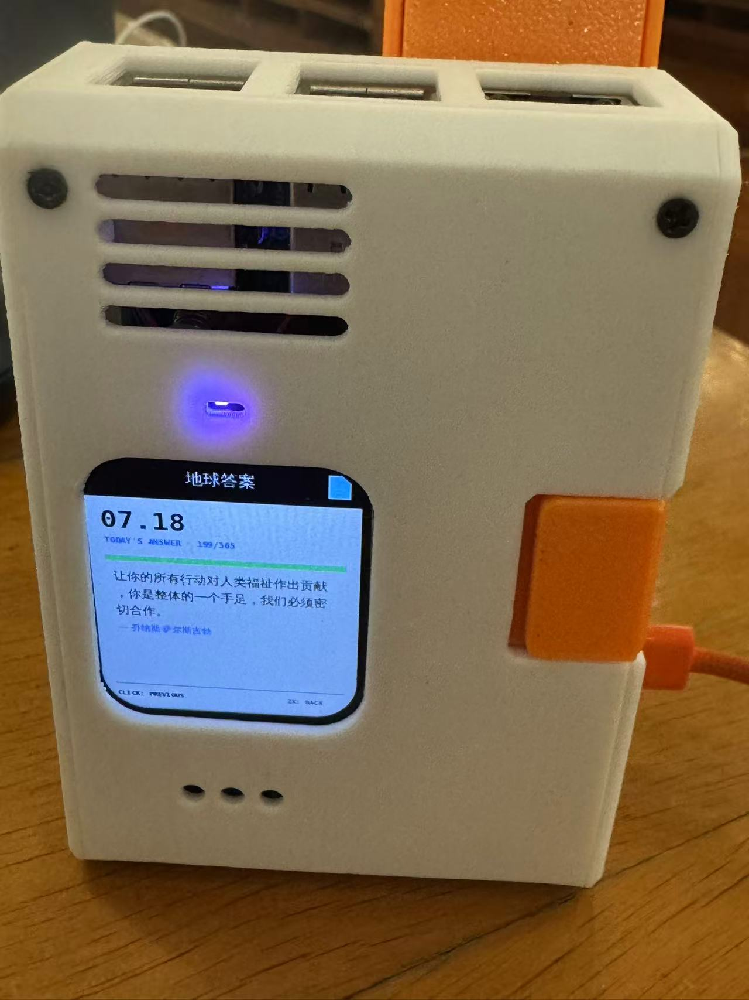

## Slide 18: 本地运行时只消费白名单公开事件

- 角色：hardware architecture
- 本页任务：说透 Injective、服务端与硬件之间的安全合同
- 关键点：
  - READ · 服务端只读 Injective 公开证据
  - ENVELOPE · 生成白名单 JSONL 事件
  - FEED · 设备 token 暴露事件流
  - CURSOR · Pi sidecar 防止重播
  - ADAPTER · 只允许 state / display / tts
  - DRIVER · Whisplay、RGB 与 TTS 执行
- 版式：全宽六步架构图：Injective 绿色 → 服务端灰蓝 → 设备橙色；底部安全边界
- Required images:
  - strict input asset：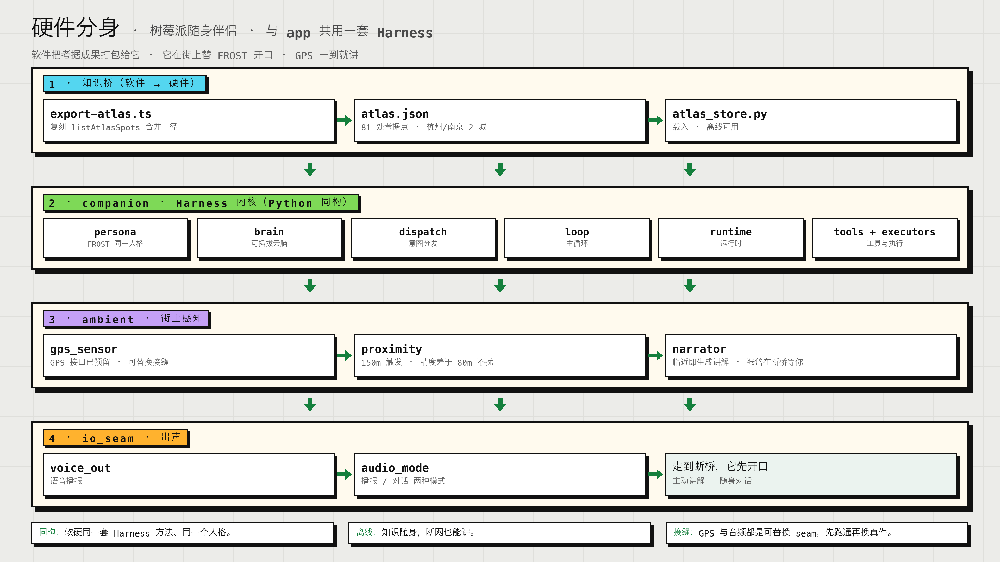

## Slide 19: 50 秒：一条公开知识走到房间里的 Frost

- 角色：live demo storyboard
- 本页任务：让软件、Injective、Azure 与实体硬件在同一画面闭环
- 关键点：
  - 01 Agent 发现并核验真实信号
  - 02 人工批准，生成资源包、recordHash 与 Merkle proof
  - 03 editionRoot 提交 Injective
  - 04 Public Earth 展开来源、proof 与 revision
  - 05 Frost #43 读取公开事件
  - 06 Edge Node 亮灯、显示并播报；手机镜像同步大屏
- 版式：六步横向闭环；右侧三个实时画面：Public Earth、Blockscout、真实硬件；步骤 03 与 06 强调色
- Required images:
  - strict input asset：
  - strict input asset：
  - strict input asset：

## Slide 20: 空间留在 Pocket Earth，时间由 Injective 见证

- 角色：closing
- 本页任务：用四个结果收束产品并留下可核验入口
- 关键点：
  - 私人记忆留在设备，形成个人空间知识
  - 公共知识形成带来源、proof 与 revision 的每日版次
  - Agent 身份、门牌与公开相遇由 Injective 持续见证
  - Microsoft Azure 调度云端推理，模型变化不会覆盖公开证据
  - Frost Edge Node 把经过验证的世界带回现实空间
- 版式：左侧大结论，右侧三张竖向证据卡：手机、Injective 交易、真实 Edge Node；底部三个入口标签
- Required images:
  - strict input asset：
  - strict input asset：
  - strict input asset：
